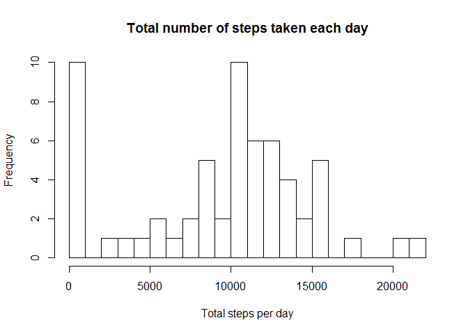
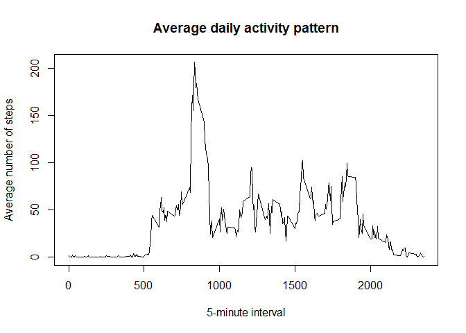
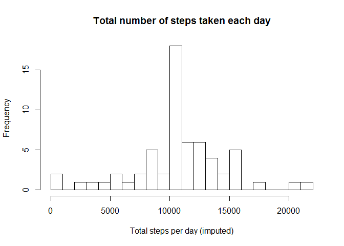
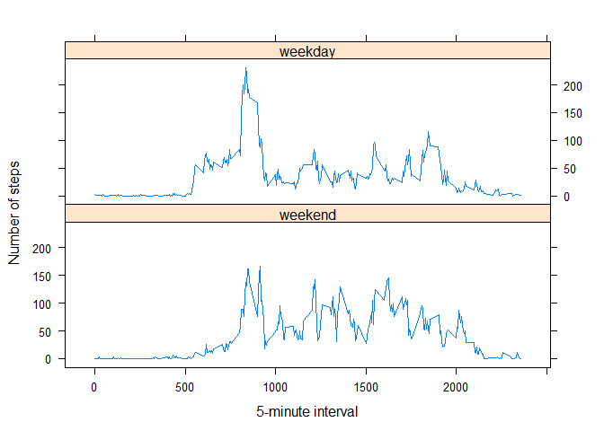

# Reproducible Research: Peer Assessment 1


## Loading and preprocessing the data


```r
if(!file.exists("activity.csv"))
{
    unzip("activity.zip")
}

activity_data <-read.csv("activity.csv")
```


## What is mean total number of steps taken per day?


```r
steps_per_day <- tapply(activity_data$steps, activity_data$date, sum, na.rm=TRUE)
```

##### A histogram of the total number of steps taken each day


```r
hist(steps_per_day, breaks = 20,
     main = "Total number of steps taken each day", 
     xlab = "Total steps per day")
```

 

##### The mean and median total number of steps taken per day


```r
mean_steps_per_day <- mean(steps_per_day)
median_steps_per_day <- median(steps_per_day)
```

* Mean: 9354.2295082
* Median:  10395


## What is the average daily activity pattern?


```r
average_pattern <- aggregate(x = list(steps = activity_data$steps), 
     by = list(interval = activity_data$interval), FUN = mean, na.rm = T)
```

##### Time series plot


```r
plot(average_pattern$interval, average_pattern$steps, type="l", 
     main = "Average daily activity pattern", xlab = "5-minute interval", 
     ylab = "Average number of steps")
```

 

##### Which 5-minute interval, on average across all the days in the dataset, contains the maximum number of steps?


```r
interval_max <- which.max(average_pattern$steps)
```

* Most steps were made during the interval #: 104

## Imputing missing values

##### The total number of missing values in the dataset


```r
missing_values_num <- sum(is.na(activity_data))
```

* The number of missing values: 2304

##### Devise a strategy for filling in all of the missing values in the dataset

###### Since the average daily activity pattern is already determined, the missing values can be replaced by corresponding values of the noted pattern.

##### Create a new dataset that is equal to the original dataset but with the missing data filled in


```r
activity_data_imp <- activity_data

na_vector <- is.na(activity_data_imp$steps)

replicated_avg_ptn <- rep(average_pattern$steps, 
                        length(na_vector)/length(average_pattern$steps))

for(i in 1:length(na_vector))
{
    if(na_vector[i] == TRUE)
    {
        activity_data_imp$steps[i] = replicated_avg_ptn[i]
    }
}
```

##### A histogram of the total number of steps taken each day 


```r
steps_per_day_imp <- tapply(activity_data_imp$steps, 
                            activity_data_imp$date, sum)
hist(steps_per_day_imp, breaks=20, 
     main = "Total number of steps taken each day", 
     xlab = "Total steps per day (imputed)")
```

 

##### The mean and median total number of steps taken per day


```r
mean_steps_per_day_imp <- mean(steps_per_day_imp)
median_steps_per_day_imp <- median(steps_per_day_imp)
```

* Mean (imputed): 1.0766189\times 10^{4}
* Median (imputed):  1.0766189\times 10^{4}


## Are there differences in activity patterns between weekdays and weekends?

##### Create a new factor variable


```r
w_days <- c("Monday", "Tuesday", "Wednesday", "Thursday", "Friday")

activity_data_imp$daytype <- factor((weekdays(as.POSIXlt(activity_data_imp$date))     %in% w_days), levels = c(FALSE, TRUE), labels = c("weekend", "weekday"))
```

##### Make a panel plot


```r
average_pattern_imp <- aggregate(steps ~ interval + daytype, 
                                  data = activity_data_imp, mean)

p <- xyplot(steps ~ interval | daytype, data = average_pattern_imp, 
    layout = c(1,2), type = "l", xlab = "5-minute interval", 
    ylab = "Number of steps")
print(p)
```

 
